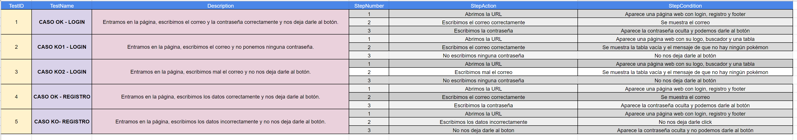
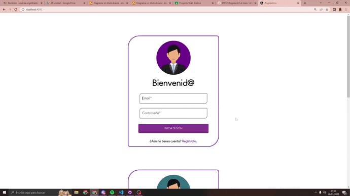
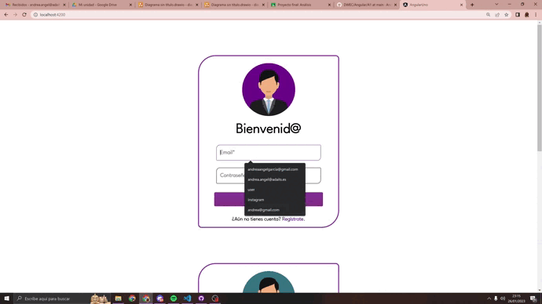
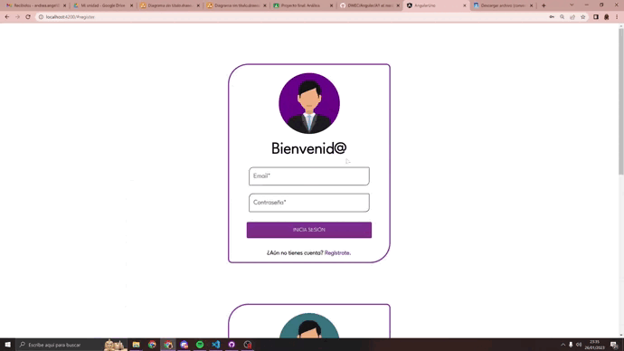
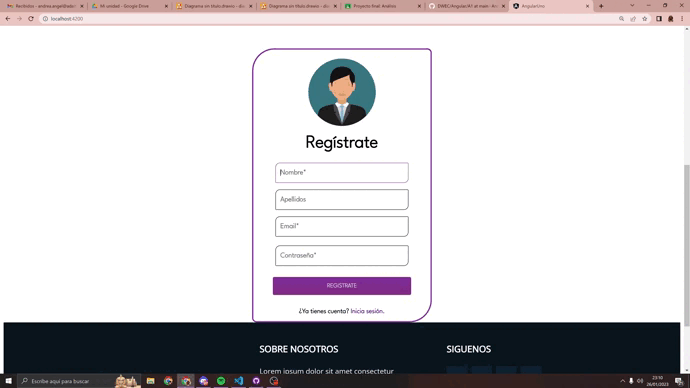

# ANGULAR

> *BOLETÍN A1 AVANZADO* ☝️

---

## 🔎 Análisis del problema.

     -> Se requiere realizar los siguientes ejercicios:
          1. Seguir los pasos de instalación del vídeo suministrado “Instalación Angular.mp4”.
          2. Crear los componentes que se indican en la siguiente imagen con la ayuda del vídeo “Componentes Angular.mp4”.
          3. Añadir las verificaciones de cada input-botón mostrando un error en caso de que no se cumplan:
              - Email: Debe ser un email con su @ y otras validaciones. Buscar en internet. No debe estar vacío.
              - Password: No deben mostrarse los caracteres, sólo los puntos. No debe estar vacío.
              - Last Name: Puede estar vacío. Es un input normal.
              - First Name: No puede estar vacío. Es un input normal.
              - Botón con texto: Puede estar habilitado o deshabilitado.
              - Hiperenlace: Mostrará diferentes textos.
          4. Añadir un componente que se pueda utilizar para el proyecto individual.
          5. Realizar un boceto de cada una de las pantallas que se vayan a utilizar en el proyecto individual con la finalidad 
             de reutilizar este trabajo y así reducir el esfuerzo total.

Primero instalaremos Angular con las indicaciones del profesor y con ayuda del vídeo.
Luego creamos los componentes (Login, registro y footer).
    

---

## ✏️ Diseño de la solución.

Para realizar este apartado de Tarea AVANZADA, lo primero que he hecho es ver el vídeo del profesor y ponerme a hacer correctamente los componentes, luego he tocado un poco el diseño.

---

## 📝 Implementación de la solución.

En este apartado vamos a ponernos a implementar todos los apartados anteriores, vamos a hacer el ejercicio completo y los gifs de cada prueba.

                                                     Este es mi boletín de cada vista para el proyecto final.

## 💡 Pruebas.

-> Plan de pruebas:

--

### -> LOGIN:

                                                                          CASO OK:
                                                                 Entramos en la página, 
                                                             ponemos el correo correctamente
                                                               e introducimos la contraseña.

---

                                                                          CASO KO 1:
                                                                     Entramos en la página, 
                                                                 ponemos el correo correctamente
                                                               y no introducimos ninguna contraseña.

---

                                                                            CASO KO 2:
                                                                       Entramos en la página, 
                                                                 ponemos el correo de manera errónea
                                                                     e introducimos la contraseña.

---

### -> REGISTRO:

                                                                  CASO OK:
                                                                 Entramos en la página, 
                                                             ponemos los datos correctamente
                                                               e introducimos la contraseña.

---

                                                                 CASO KO:
                                                              Entramos en la página, 
                                                no introducimos los datos o los ponemos incorrectamente
                                                        no nos deja darle al botón.

---

