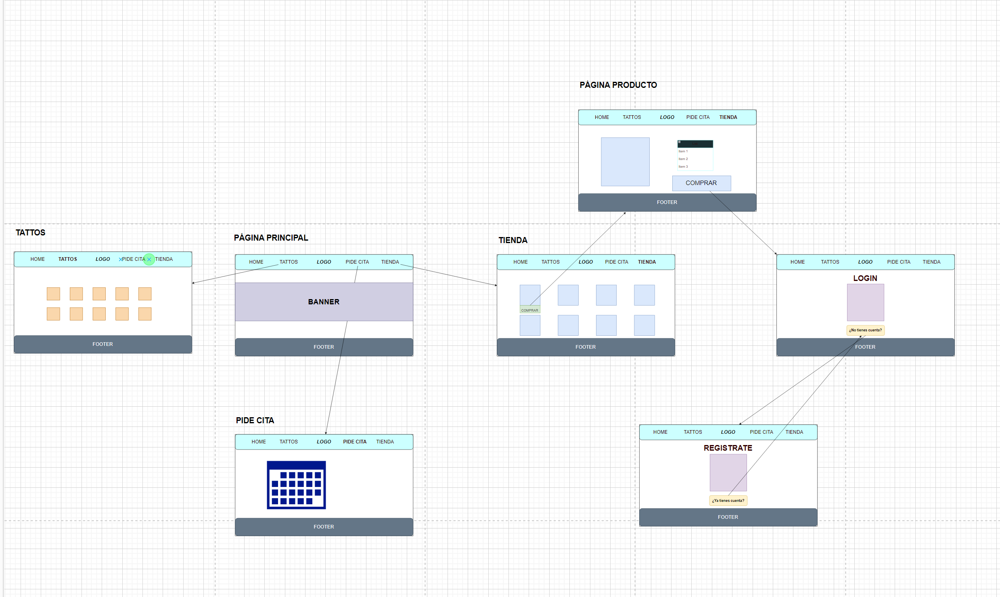
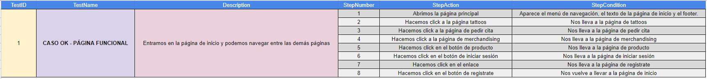
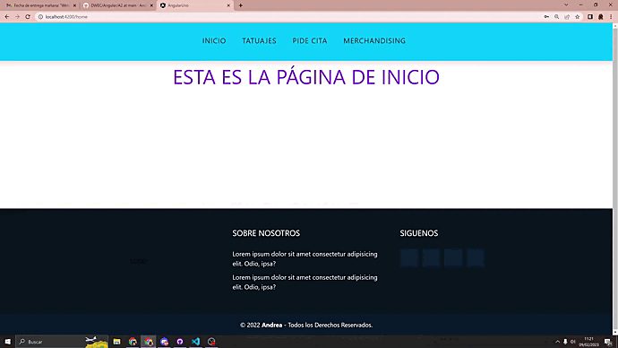

# ANGULAR 

> *BOLETÍN A2 AVANZADO* ☝️

---

## 🔎 Análisis del problema.

     -> Se requiere realizar el siguiente ejercicio:
         Siguiendo el boceto del anterior boletín avanzado o suministrando uno más actualizado para el proyecto individual.
         Establecer toda la navegación entre componentes o páginas del proyecto individual, 
         aplicando las validaciones que se vean oportunas en el caso que toque.

Primero crearemos la carpeta pages y meteremos en carpetas cada una de las páginas de mi proyecto final, después meteremos los componentes dentro de esas páginas.
Debemos utilizar `routerLink` para unir las páginas y los `path` en `app-routing.module.ts`.

### -> routerLink:
Cuando se aplica a un elemento en una plantilla, convierte ese elemento en un enlace que inicia la navegación a una ruta. La navegación abre uno o más componentes enrutados en una o más ubicaciones en la página.`<router-outlet>`
    

---

## ✏️ Diseño de la solución.

Para realizar este apartado de Tarea AVANZADA, lo primero que he hecho es crear la carpeta pages de cada vista de mi proyecto, luego he añadido los componentes dentro y finalmente los he unido con `routerLink` y los `path`.

---

## 📝 Implementación de la solución.

En este apartado vamos a ponernos a implementar todos los apartados anteriores, vamos a hacer el ejercicio completo, el plan de pruebas y las pruebas.

---

## 💡 Pruebas.

### -> PLAN DE PRUEBAS:

### -> PRUEBAS:

                                                                          CASO OK:
                                           Abrimos la página principal y podremos navegar por cada una de las páginas 
                                                           a través del menú de navegación y los botones.

