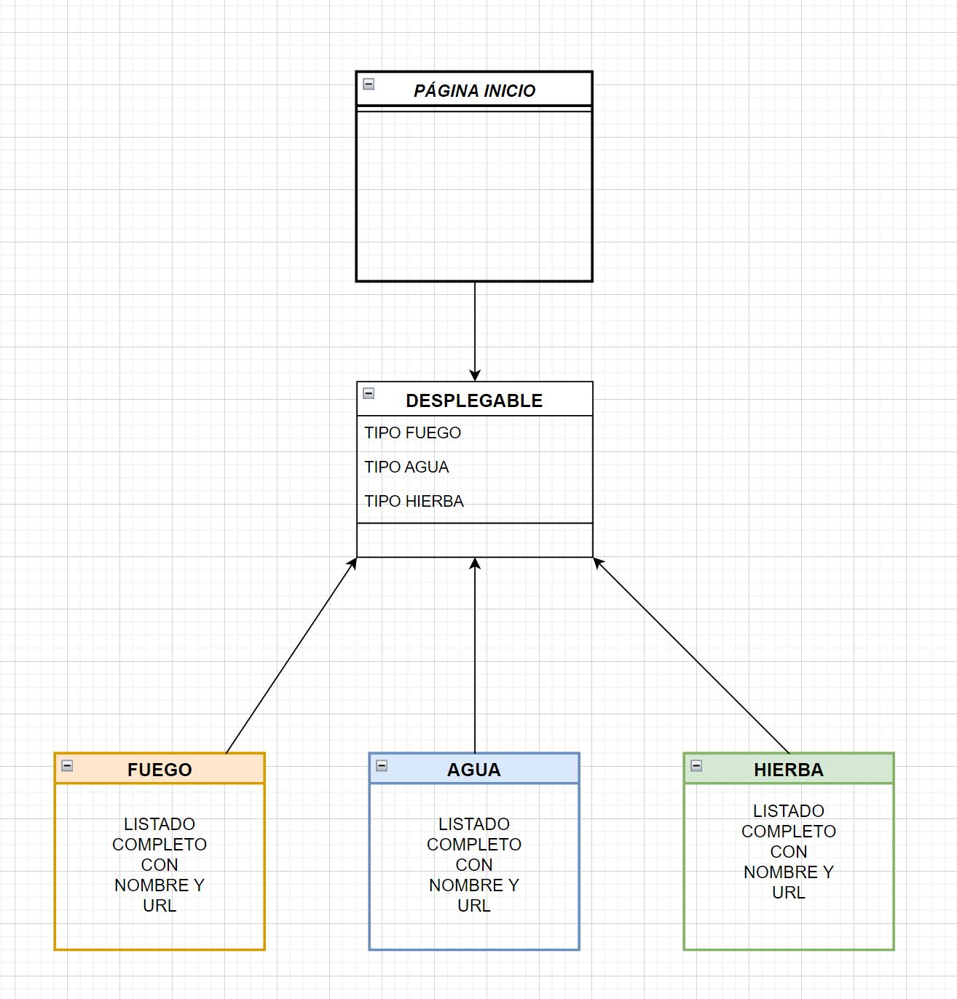

# ANGULAR 

> *BOLETÍN A3A4 INTERMEDIO* ☝️

---

## 🔎 Análisis del problema.

     -> Se requiere realizar los siguientes ejercicios:
     
          - Aplicar los conceptos dados en la teoría para ampliar las funcionalidades del proyecto utilizando las directivas explicadas
               y la comunicación entre componentes.
          - Investigar sobre las directivas ngStyle, ngClass y ngTemplate y darle un uso en el proyecto si se viese necesario.
          
          Este boletín también va enfocado al uso de la recogida de datos mediante servicios,
          para ello se creará una nueva página que contenga los siguientes elementos:
          
          - Desplegable con las opciones Fuego (Fire), Agua (Water), Hierba (Grass). Opción de Fuego (Fire) por defecto seleccionado.
          - Un listado de los nombres de los Pokemons del tipo seleccionado en el desplegable arriba mencionado. 
               Los nombres serán hipervínculos que al ser seleccionados nos lleve a la url que viene informado en el servicio.
          Para realizar este ejercicio será necesario el uso de la Pokeapi que vimos en anteriores sprints. https://pokeapi.co/
          La petición de filtrado por tipos existe, por lo que tenéis que destinar unos minutos en averiguar cuál es
               la url necesaria para recoger esos datos.

### -> `ngStyle`:

Una directiva de atributo que actualiza los estilos del elemento HTML que lo contiene. Establece una o más propiedades  de estilo, 
especificadas como pares clave-valor separados por dos puntos. La clave es un nombre de estilo, con un `.<unit>` sufijo opcional.
El valor es una expresión a evaluar. El valor no nulo resultante, expresado en la unidad dada, se asigna a la propiedad de estilo dada.
Si el resultado de la evaluación es nulo, se elimina el estilo correspondiente.
          
Ej: ` <some-element [ngStyle]="{'font-style': styleExp}">...</some-element> `

### -> `ngClass`: 

La ngClassdirectiva le permite establecer dinámicamente clases CSS en un elemento HTML mediante el enlace de datos de una expresión 
que representa todas las clases que se agregarán. La directiva opera de tres maneras diferentes, dependiendo de cuál de los tres tipos 
se evalúa a la expresión:
- Si la expresión se evalúa como una cadena, la cadena debe ser uno o más nombres de clase delimitados por espacios.

- Si la expresión se evalúa como un objeto, entonces para cada par clave-valor del objeto con un valor verdadero, la clave correspondiente se usa como nombre de clase.

- Si la expresión se evalúa como una matriz, cada elemento de la matriz debe ser una cadena como en el tipo 1 o un objeto como en el tipo 2. Esto significa que puede mezclar cadenas y objetos en una matriz para tener más control sobre lo que Aparecen las clases CSS. Vea el código a continuación para ver un ejemplo de esto.

La directiva no agregará clases duplicadas si ya se configuró una clase en particular. Cuando la expresión cambia,
las clases agregadas previamente se eliminan y solo entonces se agregan las nuevas clases.

Ej: `<some-element [ngClass]="'first second'">...</some-element>`

`<some-element [ngClass]="['first', 'second']">...</some-element>`

### -> `ngTemplate`:

La `ngTemplate` puede definir el contenido de la plantilla que Angular solo representa cuando usted, ya sea directa o indirectamente, le indica específicamente que lo haga, lo que le permite tener un control total sobre cómo y cuándo se muestra el contenido.

Ej: `
Hip!

     <ng-template>
     
Hip!

     </ng-template>
     
Hooray!
`

---

## ✏️ Diseño de la solución.

Para realizar este apartado de Tarea INTERMEDIA, lo primero que he hecho es buscar los conceptos que debíamos buscar y poner un ejemplo. Después he hecho el ejercicio de los pokemons.

###  UML

---

## 📝 Implementación de la solución.

En este apartado vamos a ponernos a implementar todos los apartados anteriores, vamos a hacer el ejercicio completo, el plan de pruebas y las pruebas.

---

## 💡 Pruebas.

### -> PLAN DE PRUEBAS:

### -> PRUEBAS:

                                                                          CASO OK:
                                           Abrimos la página principal y podremos navegar por cada una de las páginas 
                                                           a través del menú de navegación y los botones.

