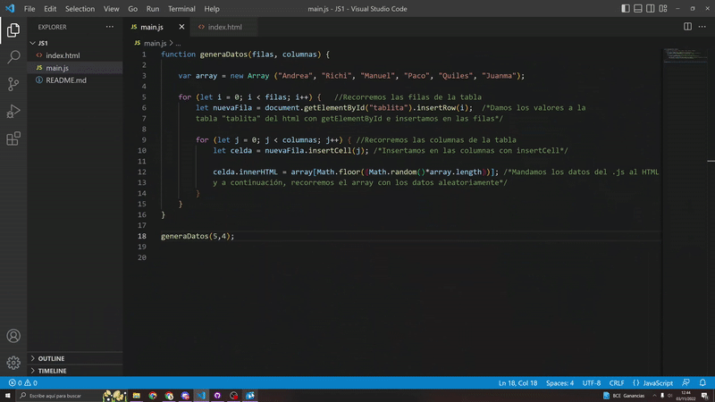
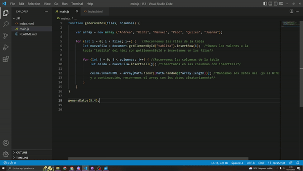

# JAVASCRIPT

> *BOLETÍN JS1 AVANZADO* ☝️

---

## 🔎 Análisis del problema.

Se requieren crear un script de JavaScript que contenga un método de generación de datos de una tabla expuesta a la web con el método ‘document.write(variable);’.
A continuación, se deberá representar en un HTML todos los datos que se generen en el método previamente generado para rellenar los datos de una tabla HTML.

Primero vamos a analizar cada uno de los términos y saber su definición:
## -> 
      </head>

      <body onload="newContent();">
        
Some original document content.

      </body>
    </html>
    
  ## -> inner.HTML
  La propiedad Element.innerHTML devuelve o establece la sintaxis HTML describiendo los descendientes del elemento.
  
  ## -> Método .insertRow()
  Inserta una nueva fila en un determinada tabla y devuelve una referencia a la nueva fila.
  
  ## -> Método .insertCell()
  Inserta una nueva celda  en una fila de la tabla y devuelve una referencia a la celda.
  

---

## ✏️ Diseño de la solución.

Para realizar este apartado de Tarea AVANZADA, lo primero que he hecho es buscar información sobre los scripts y sobre lo que me pedía el ejercicio. A continuación, he buscado ejemplos e información en internet y he encontrado unos métodos para insertar filas y columnas desde js ( .insertRow() e .insertCell() ). Después de encontrar esta información toca implementarla en la siguiente fase.

---

## 📝 Implementación de la solución.

En este apartado vamos a ponernos a implementar todos los apartados anteriores, vamos a hacer el ejemplo y los gifs de cada prueba.

---

## 💡 Pruebas.

                                                                          Criterio 1:
                                                            Dado que tengo un método generaDatos(5, 4)
                                                            Cuando pongo los valores fila 5 y columna 4
                                       Entonces me aparece en el html una tabla con 5 filas y 4 columnas con datos randoms.

---

                                                                  Criterio 2:
                                                    Dado que tengo un método generaDatos(4, 5)
                                                    Cuando pongo los valores fila 4 y columna 5
                                      Entonces me aparece en el html una tabla con 4 filas y 5 columnas con datos randoms.

---

                                                                  Criterio 3:
                                                    Dado que tengo un método generaDatos(12, 8)
                                                    Cuando pongo los valores fila 12 y columna 8
                                 Entonces me aparece en el html una tabla con 12 filas y 8 columnas con datos randoms.

---

