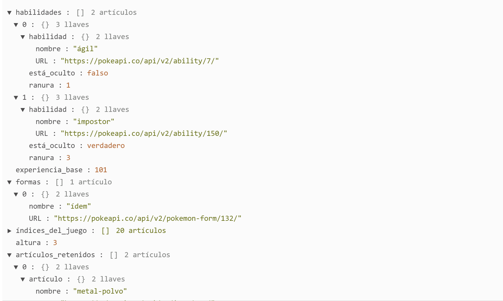
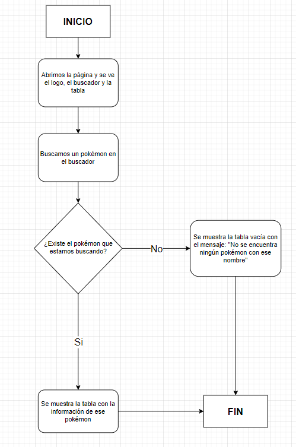
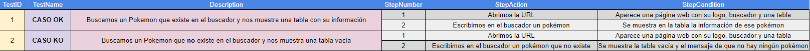
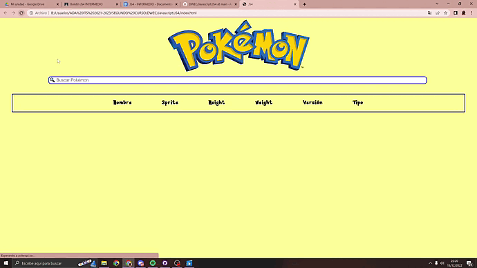
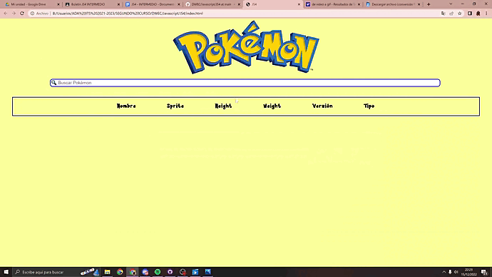

# JAVASCRIPT

> *BOLETÍN JS4 INTERMEDIO* ☝️

---

## 🔎  ANÁLISIS DEL PROBLEMA.

      1. Analizar la PokeAPI y comprobar cuales son las peticiones que son necesarias para realizar los posteriores ejercicios. 
      Esto deberá estar documentado en la fase de Análisis.
      
      2. La aplicación contendrá los siguientes elementos visuales:
      Un campo de texto editable donde al introducir el nombre de un pokemon (sin tener en cuenta si es en mayúsculas o minúsculas),
      se obtendrá la información del Pokémon que se indica a continuación.
            - Sprite del Pokémon buscado.
            - Nombre del Pokémon buscado.
            - Altura del Pokémon buscado.
            - Peso del Pokémon buscado.
            - Listado del nombre de las versiones en las que aparece el Pokémon buscado.
            - Tipo/s del Pokémon buscado.

## -> POKEAPI 🐾
He estado analizando la PokeApi y probando cuáles son las peticiones que tengo que hacer para sacar la información de cada pokemon.
Debemos usar Postman para ayudarnos a sacarlo.

      - "https://pokeapi.co/api/v2/pokemon?limit=100000&offset=0" -> Para sacar todos los pokémons.
      - "https://pokeapi.co/api/v2/pokemon/ditto" -> Para sacar la información del pokemon en concreto, en este caso `Ditto`.
         En este caso cuando hacemos esta petición a la PokeApi, sale está información:
                       
                       
             

En el caso del ejercicio debemos sacar:

            - Sprite.
            - Nombre.
            - Altura.
            - Peso.
            - Listado del nombre de las versiones en las que aparece.
            - Tipo/s.
            
En el caso del nombre -> debemos coger `nombre`.

En el caso del sprite -> debemos coger `sprites`. y luego `front_default` (sprites.front_default).

En el caso de la altura -> debemos coger `height`.

En el caso del peso -> debemos coger `weight`.

En el caso de las versiones -> debemos coger `version`.

En el caso del tipo o tipos -> debemos coger `types`.
      
      

## -> POSTMAN ✒️
      Postman es una aplicación que nos permite testear APIs a través de una interfaz gráfica de usuario. 
      Entre las ventajas que tiene Postman encontramos la capacidad de crear colecciones y distintos ambientes de pruebas.
      Postman es una herramienta fácil de usar que nos ayuda a optimizar el tiempo de ejecución de pruebas.

-> XHR: 
      
El objeto XMLHttpRequest se creó originalmente para realizar peticiones HTTP a ficheros .xml externos desde Javascript. Actualmente, se realizan las mismas operaciones pero con ficheros JSON, ya que son mucho más habituales en el ecosistema Javascript como almacenamiento ligero de datos.

El mecanismo principal de peticiones HTTP mediante XMLHttpRequest es muy sencillo, aunque se vuelve un poco más complejo a medida que vamos realizando comprobaciones y detalles relacionados, ya que se realiza todo más a bajo nivel que su equivalente moderno fetch.

El primer paso es crear un objeto XMLHttpRequest (XHR):

      // Creamos la instancia del objeto XHR
      const client = new XMLHttpRequest();

            
---

## ✏️ DISEÑO DE LA SOLUCIÓN.

Para realizar este apartado de Tarea INTERMEDIA, lo primero que he hecho es poner en práctica todo lo buscado en `Análisis del problema`. 
A continuación, he vuelto a ver el vídeo del profesor, he buscado información en internet y finalmente he realizado el diagrama de flujo.

### DIAGRAMA DE FLUJO 📈

---

## 📝 IMPLEMENTACIÓN.

En este apartado vamos a ponernos a implementar todos los apartados anteriores, vamos a hacer el ejercicio completo, el plan de pruebas y a grabar los GIFS.

---

## 📹 PRUEBAS.

### --> Plan de pruebas 📰

---

### --> GIFS:

                                                                       TESTID 1: CASO OK.

---

                                                                       TESTID 2: CASO KO.
