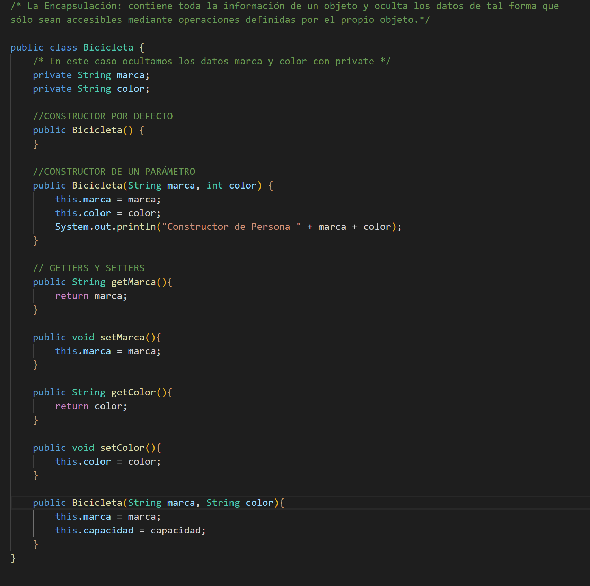
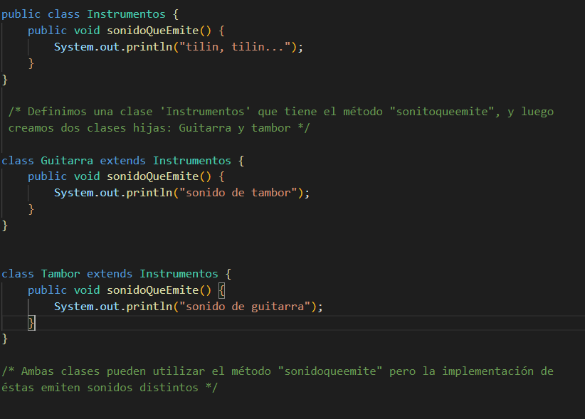

## Programación Orientada a Objetos

> *BOLETÍN POO AVANZADO*

---

### 🔎 Análisis del problema.

Se requieren ejemplos de encapsulación, abstracción, herencia y polimorfismo en Java 1.8.

#### 🤔 ¿Qué son?

Primero vamos a analizar cada uno de los términos y saber su definición:

  - **Encapsulación**: contiene toda la información de un objeto y oculta los datos de tal forma que sólo sean accesibles mediante operaciones definidas por el propio      objeto.
  El término encapsulamiento en Java, consiste en ocultar atributos de un objeto de manera que solo se pueda cambiar mediante operaciones definidas en ese objeto. Está   estrechamente relacionado con la visibilidad. 
  Para definir la visibilidad en Java, se dispone de palabras reservadas:
  
  
        - public: nos indica que es accesible desde cualquier clase [interface].
        - private: solo es accesible desde a clase actual.
        - protected: accesible desde la clase actual, sus descendientes o el paquete del que forma parte.
        - sin ninguna palabra: accesible desde cualquier clase del paquete.
  
  - **Abstracción**: La abstracción consiste en captar las características y funcionalidades que un objeto desempeña y estos son representados en clases por medio de       atributos y métodos de dicha clase.

  - **Herencia**: propiedad a través de la cual los objetos heredan comportamiento dentro de una jerarquía de clases.
Las clases o tipos heredan de sus ancestros.

  - **Polimorfismo**: es una propiedad por la cual el método invocado varía en función de la clase de la instancia de un objeto.

---

### 📝 Diseño de la solución.

Para realizar este apartado de Tarea AVANZADA, lo primero que he hecho es buscar ejemplos de los diferentes ejercicios.

**UML de ejemplo para la solución**

---

### 💡 Pruebas
**Encapsulación**

**Polimorfismo**

